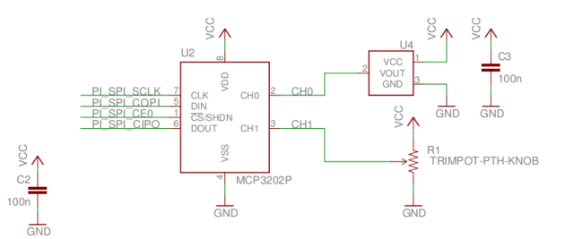

# Circuits.SPI

[](https://hex.pm/packages/circuits_spi)
[](https://hexdocs.pm/circuits_spi/Circuits.SPI.html)
[](https://circleci.com/gh/elixir-circuits/circuits_spi)

`Circuits.SPI` provides high level abstractions for interfacing to SPI buses on
Linux platforms. Internally, it uses the [Linux device
interface](https://elixir.bootlin.com/linux/latest/source/Documentation/spi/spidev)
so that it does not require board-dependent code.

## Getting started

If you're using Nerves or compiling on a Raspberry Pi or other device with SPI
support, then add `circuits_spi` like any other Elixir library:

```elixir
def deps do
  [{:circuits_spi, "~> 0.1"}]
end
```

`Circuits.SPI` doesn't load device drivers, so you'll need to load any necessary
ones beforehand. On the Raspberry Pi, the [Adafruit Raspberry Pi SPI
instructions](https://learn.adafruit.com/adafruits-raspberry-pi-lesson-4-gpio-setup/configuring-spi)
may be helpful, (This is already enabled for you if you are using Nerves)


A [Serial Peripheral
Interface](https://en.wikipedia.org/wiki/Serial_Peripheral_Interface_Bus) (SPI)
bus is a common multi-wire bus used to connect components on a circuit board. A
clock line drives the timing of sending bits between components. Bits on the
Master Out Slave In `MOSI` line go from the master (usually the processor
running Linux) to the slave, and bits on the Master In Slave Out `MISO` line go
the other direction. Bits transfer both directions simultaneously. However, much
of the time, the protocol used across the SPI bus has a request followed by a
response and in these cases, bits going the "wrong" direction are ignored. This
will become more clear in the example below.

The following shows an example Analog to Digital Converter (ADC) that reads from
either a temperature sensor on CH0 (channel 0) or a potentiometer on CH1
(channel 1). It converts the analog measurements to digital, and sends the
digital measurements to SPI pins on the main processor running Linux (e.g.
Raspberry Pi). Many processors, like the one on the Raspberry Pi, can't read
analog signals directly, so they need an ADC to convert the signal.



The protocol for talking to the ADC in the example below is described in the
[MCP3002](http://www.microchip.com/wwwproducts/en/MCP3002) data sheet. The
protocol is very similar to an application program interface (API) for
software. It will tell you the position and function of the bits you will send
to the ADC, along with how the data (in the form of bits)
will be returned.

See Figure 6-1 in the data sheet for the communication protocol. Sending a
`0x68` first reads the temperature and sending a `0x78` reads the
potentiometer. Since the data sheet shows bits, `0x68` corresponds to `01101000b`.
The leftmost bit is the "Start" bit. The second bit is SGL/DIFF, the third
bit is ODD/SIGN, and the fourth bit is MSBF. From table 5-1, if SGL/DIFF==1,
ODD/SIGN==0, and MSBF==1 then that specifies channel 0 which is connected to
the thermometer.

```elixir
# Make sure that you've enabled or loaded the SPI driver or this will
# fail.
iex> {:ok, ref} = Circuits.SPI.open("spidev0.0")
{:ok, #Reference<...>}

# Read the potentiometer

# Use binary pattern matching to pull out the ADC counts (low 10 bits)
iex> {:ok, <<_::size(6), counts::size(10)>>} = Circuits.SPI.transfer(ref, <<0x78, 0x00>>)
{:ok, <<1, 197>>}

iex> counts
453

# Convert counts to volts (1023 = 3.3 V)
iex> volts = counts / 1023 * 3.3
1.461290322580645
```

As shown above, you'll find out that Elixir's binary pattern matching is
extremely convenient when working with hardware. More information can be
found in the [Kernel.SpecialForms documentation](https://hexdocs.pm/elixir/Kernel.SpecialForms.html#%3C%3C%3E%3E/1)
and by running `h <<>>` at the IEx prompt.

## FAQ

### How do I debug?

The most common issue is communicating with a SPI device for the first time.
First check that a SPI bus is available:

```elixir
iex> Circuits.SPI.bus_names()
["spidev0.0", "spidev0.1"]
```

If the list is empty, then a SPI bus is either not available, not enabled, or
not configured in the kernel. If you're using Raspbian, run `raspi-config` and
check that SPI is enabled in the advanced options. If you're on a BeagleBone,
try running `config-pin` and see the [Universal I/O
project](https://github.com/cdsteinkuehler/beaglebone-universal-io) to enable
the SPI pins. On other ARM boards, double check that SPI is enabled in the
kernel and that the device tree configures it.

### Where can I get help?

Many issues are unrelated to `Circuits.SPI`. If you expand your searches to
include Python and C forums, it's possible that someone else has run into your
problem too. SPI libraries in other languages should be similar to
`Circuits.SPI` so hopefully you'll find the answer.

If that fails, try posting a question to the [Elixir
Forum](https://elixirforum.com/). Tag the question with `Nerves` and it will
have a good chance of getting to the right people. Feel free to do this even if
you're not using Nerves.

### Can I develop code that uses Circuits.SPI on my laptop?

You'll need to fake out the hardware. Code to do this depends on what your
hardware actually does, but here's one example:

* [Compiling and testing Elixir Nerves on your host machine](http://www.cultivatehq.com/posts/compiling-and-testing-elixir-nerves-on-your-host-machine/)

Please share other examples if you have them.

### Will it run on Arduino?

No. This only runs on Linux-based boards. If you're interested in controlling an
Arduino from a computer that can run Elixir, check out
[nerves_uart](https://hex.pm/packages/nerves_uart) for communicating via the
Arduino's serial connection or
[firmata](https://github.com/mobileoverlord/firmata) for communication using the
Arduino's Firmata protocol.

### How do I call Circuits.SPI from Erlang?

An Erlang friendly binding has been provided to simplify syntax when calling
`Circuits.SPI` functions from Erlang code.  Instead of prefixing calls with:
`'Elixir.Circuits.SPI':` you may use the binding: `circuits_spi:`.  For example:
`circuits_spi:open("spidev0.1")`.

## License

Code from the library is licensed under the Apache License, Version 2.0.
